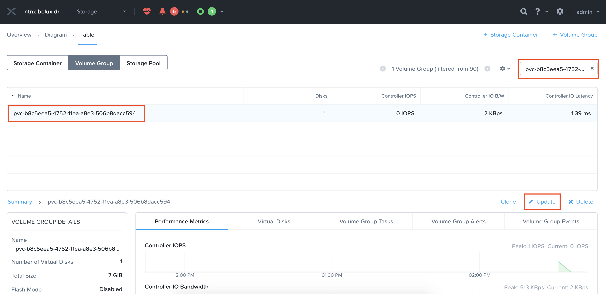
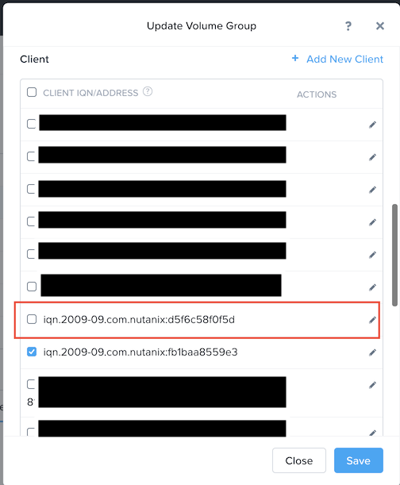
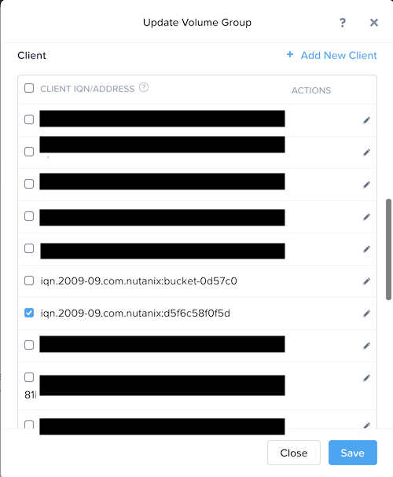

# Migrate persistent volumes between Nutanix Karbon Clusters

Creating Kubernetes clusters can be a hassle. Fortunately Nutanix Karbon offers a single click approach to deploy Kubernetes clusters on top of Nutanix. This document shows how to migrate persistent volumes between two Karbon clusters. 

Code used during this procedure can be found here: 

https://github.com/yannickstruyf3/nutanix-karbon-migrate-pv

**!! IMPORTANT !!** Only perform this procedure on dev and test environments. This procedure is not issued offically by Nutanix.

# General
Goal of this document is to:
* Create a namespace on cluster A
* Deploy application on cluster A
* Write persistent data
* Migrate persistent data to Karbon cluster B
* Redeploy application on second Karbon cluster B
* Cleanup

# Prerequisites
1. Have access to Prism Element(PE)
2. Have two Nutanix Karbon clusters deployed on the same nutanix platform
3. Have access to the Karbon clusters with kubectl
4. Have access to the Karbon clusters with ssh
5. kubens installed (optional)

## Create namespace on cluster A
```
kubectl create namespace migration-source
```
Switch to namespace:
```
kubens migration-source 
```

## Deploy application on cluster A
Create persistent volume claim
```
kubectl apply -f 1_create_pvc.yml
``` 
Create deployment
```
kubectl apply -f 2_create_deployment.yml 
```
    
Check if persistent volumes have been created
```
kubectl get pv
```
Output:
```
NAME                                     CAPACITY   ACCESS MODES   RECLAIM POLICY   STATUS        CLAIM                                                            STORAGECLASS           REASON   AGE

pvc-b8c5eea5-4752-11ea-a8e3-506b8dacc594   7Gi        RWO            Delete           Bound         migration-source/pvc-migration-test                              default-storageclass            12m
```
Verify the contents of the persistent volume.
```
kubectl get pv pvc-b8c5eea5-4752-11ea-a8e3-506b8dacc594 -o yaml
```
Output:
```yaml
apiVersion: v1
kind: PersistentVolume
metadata:
  annotations:
    pv.kubernetes.io/provisioned-by: com.nutanix.csi
  creationTimestamp: "2020-02-04T13:32:04Z"
  finalizers:
  - kubernetes.io/pv-protection
  name: pvc-b8c5eea5-4752-11ea-a8e3-506b8dacc594
  resourceVersion: "10628544"
  selfLink: /api/v1/persistentvolumes/pvc-b8c5eea5-4752-11ea-a8e3-506b8dacc594
  uid: bb1a932c-4752-11ea-a8e3-506b8dacc594
spec:
  accessModes:
  - ReadWriteOnce
  capacity:
    storage: 7Gi
  claimRef:
    apiVersion: v1
    kind: PersistentVolumeClaim
    name: pvc-migration-test
    namespace: migration-source
    resourceVersion: "10628515"
    uid: b8c5eea5-4752-11ea-a8e3-506b8dacc594
  csi:
    driver: com.nutanix.csi
    fsType: ext4
    nodePublishSecretRef:
      name: ntnx-secret-00058ef8-c31c-f0bc-0000-000000007b23
      namespace: kube-system
    volumeAttributes:
      fsType: ext4
      iqn: iqn.2010-06.com.nutanix:ntnx-k8s-7024ed55-ed7f-4300-baaa-73177fcf5f1f-tgt0
      iscsiInterface: default
      lun: "0"
      storage.kubernetes.io/csiProvisionerIdentity: 1576055264270-8081-com.nutanix.csi
      targetPortal: 10.10.20.6:3260
    volumeHandle: NutanixVolumes-7024ed55-ed7f-4300-baaa-73177fcf5f1f
  persistentVolumeReclaimPolicy: Delete
  storageClassName: default-storageclass
  volumeMode: Filesystem
status:
  phase: Bound

```
**!! IMPORTANT !!** Please note the persistentVolumeReclaimPolicy is set to `Delete`. When performing this migration procedure, it is advised to put the policy to `Retain`. This way the volume will not be deleted in case of an error.

```
kubectl patch pv pvc-b8c5eea5-4752-11ea-a8e3-506b8dacc594 -p '{"spec":{"persistentVolumeReclaimPolicy":"Retain"}}'
```

Check the persistent volume again and make sure the persistentVolumeReclaimPolicy is set to `Retain`. Save the output to a file called `source_pv.yml`
```
kubectl get pv pvc-b8c5eea5-4752-11ea-a8e3-506b8dacc594 -o yaml
```

Check if persistent volume claims have been created:
```
kubectl get pvc
```
Output: 
```
NAME                 STATUS   VOLUME                                     CAPACITY   ACCESS MODES   STORAGECLASS           AGE
pvc-migration-test   Bound    pvc-b8c5eea5-4752-11ea-a8e3-506b8dacc594   7Gi        RWO            default-storageclass   15m
```

Save following yaml output in a file (for example `source_pvc.yml`). We will need it later.
```
kubectl get pvc pvc-migration-test -o yaml
```
Output:
```yaml
apiVersion: v1
kind: PersistentVolumeClaim
metadata:
  annotations:
    kubectl.kubernetes.io/last-applied-configuration: |
      {"apiVersion":"v1","kind":"PersistentVolumeClaim","metadata":{"annotations":{},"name":"pvc-migration-test","namespace":"migration-source"},"spec":{"accessModes":["ReadWriteOnce"],"resources":{"requests":{"storage":"7Gi"}}}}
    pv.kubernetes.io/bind-completed: "yes"
    pv.kubernetes.io/bound-by-controller: "yes"
    volume.beta.kubernetes.io/storage-provisioner: com.nutanix.csi
  creationTimestamp: "2020-02-04T13:32:00Z"
  finalizers:
  - kubernetes.io/pvc-protection
  name: pvc-migration-test
  namespace: migration-source
  resourceVersion: "10628545"
  selfLink: /api/v1/namespaces/migration-source/persistentvolumeclaims/pvc-migration-test
  uid: b8c5eea5-4752-11ea-a8e3-506b8dacc594
spec:
  accessModes:
  - ReadWriteOnce
  resources:
    requests:
      storage: 7Gi
  storageClassName: default-storageclass
  volumeMode: Filesystem
  volumeName: pvc-b8c5eea5-4752-11ea-a8e3-506b8dacc594
status:
  accessModes:
  - ReadWriteOnce
  capacity:
    storage: 7Gi
  phase: Bound

```

Verify if pods are running:
```
kubectl get pods
```
Output:
```
NAME                                         READY   STATUS    RESTARTS   AGE
migration-test-deployment-668b6f54b9-n2vhq   1/1     Running   0          75s
```

## Write persistent data 
In our example, we have a running container with our persistent volume mounted on `/pvc`.
Open a session inside the container and go to `/pvc`. You can find the pod name in the output of earlier commands.

```
kubectl exec -ti migration-test-deployment-668b6f54b9-n2vhq sh
```

Inside the container, check if `/pvc` is created:
<pre>
# ls -al /    
total 80
...
dr-xr-xr-x 354 root root    0 Feb  4 13:32 proc
<b><i>drwxr-xr-x   3 root root 4096 Feb  4 13:32 pvc</i></b>
drwx------   2 root root 4096 Jan 30 00:00 root
...
</pre>
Create data in `/pvc`
```
# mkdir /pvc/important_folder
# touch /pvc/very_important_file
# ls /pvc -al
total 28
drwxr-xr-x 4 root root  4096 Feb  4 13:42 .
drwxr-xr-x 1 root root  4096 Feb  4 13:32 ..
drwxr-xr-x 2 root root  4096 Feb  4 13:42 important_folder
drwx------ 2 root root 16384 Feb  4 13:32 lost+found
-rw-r--r-- 1 root root     0 Feb  4 13:42 very_important_file
```

## Migrate persistent data to Karbon cluster B
**Note:** Delete the deployment before migrating the persistent data to Karbon cluster B. To delete run:
```
kubectl delete -f 2_create_deployment.yml 
```
Before we can migrate the data from Karbon cluster A to Karbon cluster B, we need allow cluster B to see the persistent volumes used by cluster A.

First we need to retrieve our iscsi iniator name. Open an SSH session to both cluster A and B. Run following command:
```
cat /etc/iscsi/initiatorname.iscsi
```
Output cluster A:
```
iqn.2009-09.com.nutanix:fb1baa8559e3
```
Output cluster B:
```
iqn.2009-09.com.nutanix:d5f6c58f0f5d
```

Go to the prism element (PE) where the Karbon clusters are deployed. Go to
* Storage
* Table
* Volume Group


Search for the persistent volume. In this case it is `pvc-b8c5eea5-4752-11ea-a8e3-506b8dacc594`



Click on the volume and press `Update`. Scroll down in the pop-up box and find the `Client` section.



Notice cluster A is checked. Find the IQN of cluster B in the list and click it. Press `Save`. A pop-up box will be presented but press `Allow`.

**Note: Since our deployment has been removed, no reads and writes are happening on the volume** 

**!! IMPORTANT !!** Point your kubectl to cluster B

Verify if you pointed your kubectl file to cluster B. First we create a new namespace on cluster B
```
kubectl create namespace migration-target
```
Switch to namespace:
```
kubens migration-target
```

Open the `source_pvc.yml` file. Remove following fields: 
* `uuid`
* `creationTimestamp`
* `resourceVersion`
Modify the value of `namespace` to the newly created namespace on cluster B. In this case `migration-source` to `migration-target`. Make sure you have ALL occurrences including `selfLInk`.
Contents of `source_pvc.yml` after the modifications:
```yaml
apiVersion: v1
kind: PersistentVolumeClaim
metadata:
  annotations:
    kubectl.kubernetes.io/last-applied-configuration: |
      {"apiVersion":"v1","kind":"PersistentVolumeClaim","metadata":{"annotations":{},"name":"pvc-migration-test","namespace":"migration-target"},"spec":{"accessModes":["ReadWriteOnce"],"resources":{"requests":{"storage":"7Gi"}}}}
    pv.kubernetes.io/bind-completed: "yes"
    pv.kubernetes.io/bound-by-controller: "yes"
    volume.beta.kubernetes.io/storage-provisioner: com.nutanix.csi
  finalizers:
  - kubernetes.io/pvc-protection
  name: pvc-migration-test
  namespace: migration-target
  selfLink: /api/v1/namespaces/migration-target/persistentvolumeclaims/pvc-migration-test
spec:
  accessModes:
  - ReadWriteOnce
  resources:
    requests:
      storage: 7Gi
  storageClassName: default-storageclass
  volumeMode: Filesystem
  volumeName: pvc-b8c5eea5-4752-11ea-a8e3-506b8dacc594
status:
  accessModes:
  - ReadWriteOnce
  capacity:
    storage: 7Gi
  phase: Bound

```
Create the pvc on cluster B
```
kubectl apply -f source_pvc.yml
```
Verify if the pvc has been created

```
kubectl get pvc
```
Output:
```
NAME                 STATUS   VOLUME                                     CAPACITY   ACCESS MODES   STORAGECLASS           AGE
pvc-migration-test   Lost     pvc-b8c5eea5-4752-11ea-a8e3-506b8dacc594   0                         default-storageclass   30s
```
Do not mind the `Lost` state. This is due to the fact that we did not yet create the persistent volume itself.
Retrieve the uuid of the persistent volume claim.
```
kubectl get pvc pvc-migration-test -o yaml
```
Output:
```yaml
...  
  resourceVersion: "132889"
  selfLink: /api/v1/namespaces/migration-target/persistentvolumeclaims/pvc-migration-test
  uid: 435ed871-4755-11ea-8759-506b8df05512
spec:
  accessModes:
...
```

Open `source_pv.yaml`.
Modify the value of `namespace` to the newly created namespace on cluster B. In this case `migration-target`.
Changed the `uuid` value in the `ClaimRef` section to the value of the created persistent volume claim.
```yaml
  claimRef:
    apiVersion: v1
    kind: PersistentVolumeClaim
    name: pvc-migration-test
    namespace: migration-target
    uid: 435ed871-4755-11ea-8759-506b8df05512 # == new value
```
Save the file and apply the yaml.
```
kubectl apply -f source_pv.yml 
```
The persistent volume is now recreated and the status for the persistent volume claim is now bound.
```
kubectl get pv
```
Output:
```
NAME                                       CAPACITY   ACCESS MODES   RECLAIM POLICY   STATUS   CLAIM                                                            STORAGECLASS           REASON   AGE
pvc-b8c5eea5-4752-11ea-a8e3-506b8dacc594   7Gi        RWO            Retain           Bound    migration-target/pvc-migration-test                              default-storageclass            16m
```
```
kubectl get pvc
```
Output:
```
NAME                 STATUS   VOLUME                                     CAPACITY   ACCESS MODES   STORAGECLASS           AGE
pvc-migration-test   Bound    pvc-b8c5eea5-4752-11ea-a8e3-506b8dacc594   7Gi        RWO            default-storageclass   41m
```

Go back to Prism Element(PE), search for the volume and press `Update`. Uncheck the IQN entry of cluster A.


## Redeploy application on second Karbon cluster B
Everything is in place to redeploy the application on cluster B
```
kubectl apply -f 2_create_deployment.yml
```
Wait for the container is running
```
kubectl get pods
```
Output:
```
NAME                                         READY   STATUS    RESTARTS   AGE
migration-test-deployment-668b6f54b9-dgc6b   1/1     Running   0          43s
```

Check the data inside the container:
```
kubectl exec -ti migration-test-deployment-668b6f54b9-dgc6b sh
```
Output:
```
# ls /pvc -al
total 28
drwxr-xr-x 4 root root  4096 Feb  4 13:42 .
drwxr-xr-x 1 root root  4096 Feb  4 14:12 ..
drwxr-xr-x 2 root root  4096 Feb  4 13:42 important_folder
drwx------ 2 root root 16384 Feb  4 13:32 lost+found
-rw-r--r-- 1 root root     0 Feb  4 13:42 very_important_file
```

## Cleanup
**!! IMPORTANT !!** Point your kubectl to cluster A
Delete the pvc
```
kubectl delete -f 1_create_pvc.yml
```

Delete the pv
```
kubectl delete pv pvc-b8c5eea5-4752-11ea-a8e3-506b8dacc594
```

At this point the persistent volume is migrated from cluster A to cluster B.

Keep in mind that the persistentVolumeReclaimPolicy is set to `Retain`. Deleting the persistent volume on Kubernetes will not delete the volume on Nutanix level.

Changing the persistentVolumeReclaimPolicy to the default value can be done via this command:
```
kubectl patch pv pvc-b8c5eea5-4752-11ea-a8e3-506b8dacc594 -p '{"spec":{"persistentVolumeReclaimPolicy":"Delete"}}'
```
